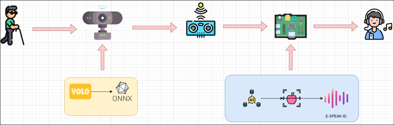
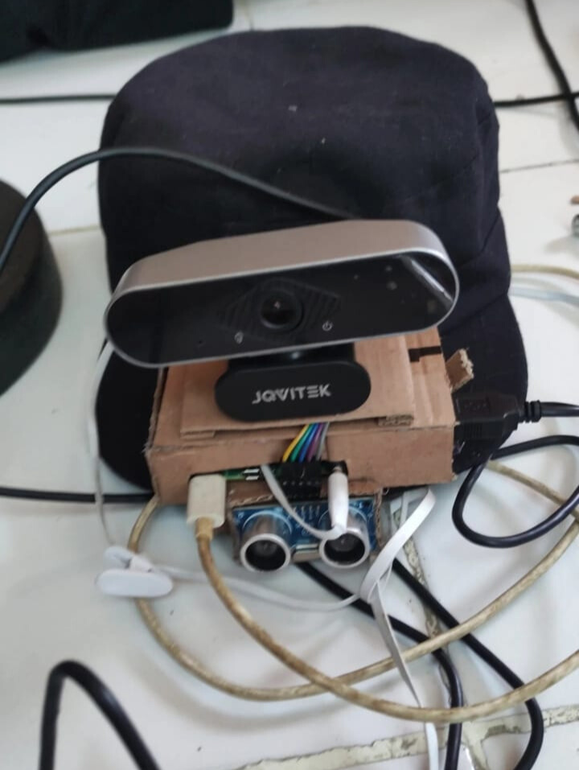
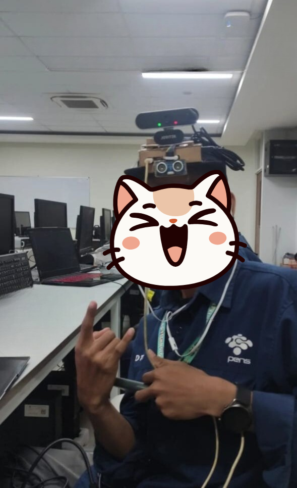
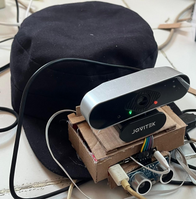

# IuSee - Blind Assistance with Computer Vision and Voice

A real-time object detection and distance measurement system designed to assist visually impaired individuals. The system uses computer vision to detect objects and provides audio feedback about nearby obstacles and their distances.

## 🚀 Tech Stack

### Core Technologies

- **Python 3.11+** - Main programming language
- **Yolov8n** - Custom dataset to train yolov8n
- **OpenCV** - Computer vision and image processing
- **ONNX Runtime** - Machine learning model inference
- **eSpeak** - Text-to-speech synthesis

### Hardware Components

- **Raspberry Pi** - Main computing platform (production)
- **USB Camera** - Visual input device
- **Ultrasonic Sensor (HC-SR04)** - Distance measurement
- **GPIO Pins** - Hardware interfacing

### Machine Learning

- **ONNX Model** - Custom trained object detection model
- **YOLOv8-based Architecture** - Real-time object detection
- **Custom Dataset** - Trained on Indonesian objects/scenarios

### System Integration

- **systemd** - Service management for auto-start
- **Threading** - Concurrent processing for camera, detection, and TTS
- **Queue Management** - Frame buffering and processing

## 📋 Features

- **Real-time Object Detection**: Detects 10 different object types in Indonesian context
- **Distance Measurement**: Ultrasonic sensor integration for proximity alerts
- **Audio Feedback**: Indonesian voice announcements with eSpeak
- **Debug Mode**: Mock sensors for development on non-Raspberry Pi systems
- **Performance Monitoring**: FPS tracking and optimization
- **Automatic Startup**: systemd service for boot-time initialization
- **Configurable Thresholds**: Adjustable detection confidence and distance alerts

## 🏗️ System Architecture



## 🤳 Product Preview







## 🔧 Installation

### Prerequisites

- Raspberry Pi 4 (recommended) or development machine
- Python 3.11 or higher
- USB camera
- HC-SR04 ultrasonic sensor (for production)
- eSpeak text-to-speech engine

### 1. Clone the Repository

```bash
git clone https://github.com/indonumberone/blind-assistance-with-CV-and-Voice
cd blind-assistance-with-CV-and-Voice
```

### 2. Create Virtual Environment

```bash
python3 -m venv .venv
source .venv/bin/activate  # On Windows: .venv\Scripts\activate
```

### 3. Install Dependencies

```bash
pip install -r requirements.txt
```

### 4. Install eSpeak (Linux/Raspberry Pi)

```bash
sudo apt update
sudo apt install espeak espeak-data
```

### 5. Hardware Setup (Raspberry Pi only)

Connect the HC-SR04 ultrasonic sensor:

- VCC → 5V
- GND → Ground
- Trig → GPIO 14
- Echo → GPIO 15

## ⚙️ Configuration

Edit [`config.py`](config.py) to customize system behavior:

### Development vs Production

```python
DEBUG_MODE = True   # Set to False for Raspberry Pi deployment
```

### Object Detection Settings

```python
CONFIDENCE_THRESHOLD = 0.5  # Detection confidence (0.0-1.0)
PROCESS_EVERY_N_FRAMES = 2  # Process every N frames for performance
```

### Distance Alerts

```python
DISTANCE_THRESHOLD_CM = 400  # Alert distance in centimeters
```

### Detected Object Classes

The system can detect these objects (in Indonesian):

- Tempat Sampah (Trash bin)
- Kursi (Chair)
- Lampu lalu lintas (Traffic light)
- Lubang-jalan (Road hole)
- Mobil (Car)
- Motor (Motorcycle)
- Manusia (Human)
- Pohon (Tree)
- Tangga (Stairs)
- Zebracross (Zebra crossing)

## 🚀 Usage

### Development Mode (Any System)

```bash
python main.py
```

### Production Deployment (Raspberry Pi)

1. Update paths in [`iusee.service`](iusee.service)
2. Run the deployment script:

```bash
chmod +x run.sh
./run.sh
```

### Manual Service Management

```bash
# Start service
sudo systemctl start iusee.service

# Check status
sudo systemctl status iusee.service

# View logs
journalctl -u iusee.service -f

# Stop service
sudo systemctl stop iusee.service
```

## 🎮 Controls

- **Q key**: Quit application (when preview window is active)
- **Ctrl+C**: Stop application from terminal

## 📊 Monitoring

### FPS Display

Enable FPS monitoring in [`config.py`](config.py):

```python
SHOW_FPS = True
FPS_UPDATE_INTERVAL = 1.0  # Update every second
```

### Bounding Box Visualization

```python
SHOW_BBOXES = True  # Show detection boxes on screen
```

### Log Files (Production)

```bash
tail -f /home/pi/logs/iusee.log
```

## 🔧 Components Overview

### [`main.py`](main.py)

Main application orchestrator handling:

- System initialization
- Frame processing loop
- Detection and distance correlation
- Audio feedback coordination

### [`object_detector.py`](object_detector.py)

ONNX-based object detection:

- Real-time camera capture
- Multi-threaded frame processing
- YOLO model inference
- Bounding box visualization

### [`distance_sensor.py`](distance_sensor.py)

Ultrasonic distance measurement:

- GPIO-based sensor control
- Mock sensor for development
- Distance calculation and filtering

### [`text_to_speech.py`](text_to_speech.py)

Audio feedback system:

- eSpeak integration
- Threaded speech queue
- Indonesian voice synthesis

### [`config.py`](config.py)

Centralized configuration:

- Hardware settings
- Detection parameters
- System behavior toggles

## 🐛 Troubleshooting

### Camera Issues

```bash
# List available cameras
ls /dev/video*

# Test camera
ffplay /dev/video0
```

### Permission Issues (Raspberry Pi)

```bash
# Add user to video group
sudo usermod -a -G video $USER

# GPIO permissions
sudo usermod -a -G gpio $USER
```

### eSpeak Not Working

```bash
# Test eSpeak
espeak "test audio"

# Install Indonesian voice
sudo apt install espeak-data
```

### Service Won't Start

```bash
# Check service logs
journalctl -u iusee.service -e

# Verify paths in service file
sudo systemctl edit iusee.service
```

## 📈 Performance Optimization

- __Frame Processing__: Adjust `PROCESS_EVERY_N_FRAMES` for performance
- __Detection Confidence__: Increase `CONFIDENCE_THRESHOLD` to reduce false positives
- __Inference Size__: Modify `INFERENCE_SIZE` for speed vs accuracy trade-off
- **Center Focus**: Detection optimized for center region of frame

## 🤝 Contributing

1. Fork the repository
2. Create a feature branch
3. Make your changes
4. Test on both development and Raspberry Pi environments
5. Submit a pull request

## 📄 License

This project is licensed under the MIT License - see the LICENSE file for details.

## 🙏 Acknowledgments

- Indonesian dataset contributors
- OpenCV community
- ONNX Runtime developers
- eSpeak text-to-speech engine
- Raspberry Pi Foundation

---

**Note**: This system is designed as an assistive technology. Always use in conjunction with traditional mobility aids and training.
